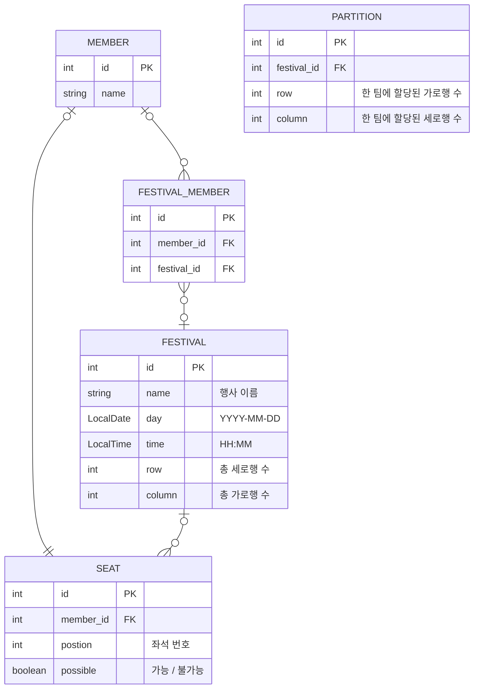

```mermaid
    erDiagram
    FESTIVAL_MEMBER }o--o| FESTIVAL : ""
    MEMBER |o--o{ FESTIVAL_MEMBER : "" 
    MEMBER |o--|| SEAT : ""
    FESTIVAL |o--o{ SEAT : ""
    
    FESTIVAL {
        int id PK
        string name "행사 이름"
        LocalDate day "YYYY-MM-DD"
        LocalTime time "HH:MM"
        int row "총 세로행 수" 
        int column "총 가로행 수"
    }
    PARTITION {
        int id PK
        int festival_id FK
        int row "한 팀에 할당된 가로행 수"
        int column "한 팀에 할당된 세로행 수"
    }
    SEAT {
        int id PK
        int member_id FK 
        int postion "좌석 번호"
        boolean possible "가능 / 불가능"
        
    }
    MEMBER {
        int id PK
        string name
    }
    FESTIVAL_MEMBER {
        int id PK
        int member_id FK
        int festival_id FK
    }
```