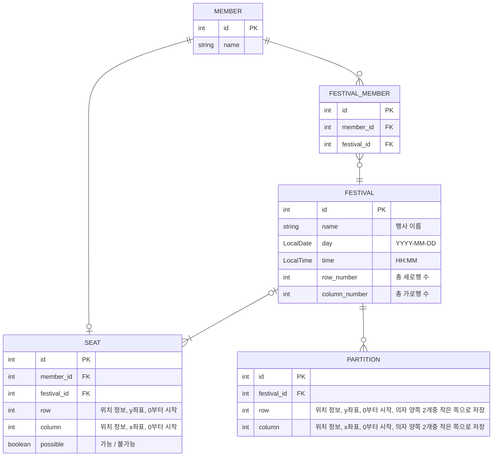

```mermaid
	erDiagram
	FESTIVAL_MEMBER }o--|| FESTIVAL : ""
	MEMBER ||--o{ FESTIVAL_MEMBER : ""
	MEMBER ||--o| SEAT : ""
	FESTIVAL |o--|{ SEAT : ""
	FESTIVAL ||--o{ PARTITION : ""

	FESTIVAL {
		int id PK
		string name "행사 이름"
		LocalDate day "YYYY-MM-DD"
		LocalTime time "HH:MM"
		int row_number "총 세로행 수"
		int column_number "총 가로행 수"
	}
	PARTITION {
		int id PK
		int festival_id FK
		int row "위치 정보, y좌표, 0부터 시작, 의자 양쪽 2개중 작은 쪽으로 저장"
		int column "위치 정보, x좌표, 0부터 시작, 의자 양쪽 2개중 작은 쪽으로 저장"
	}
	SEAT {
		int id PK
		int member_id FK
		int festival_id FK
		int row "위치 정보, y좌표, 0부터 시작"
		int column "위치 정보, x좌표, 0부터 시작"
		boolean possible "가능 / 불가능"

	}
	MEMBER {
		int id PK
		string name
	}
	FESTIVAL_MEMBER {
		int id PK
		int member_id FK
		int festival_id FK
	}
```
